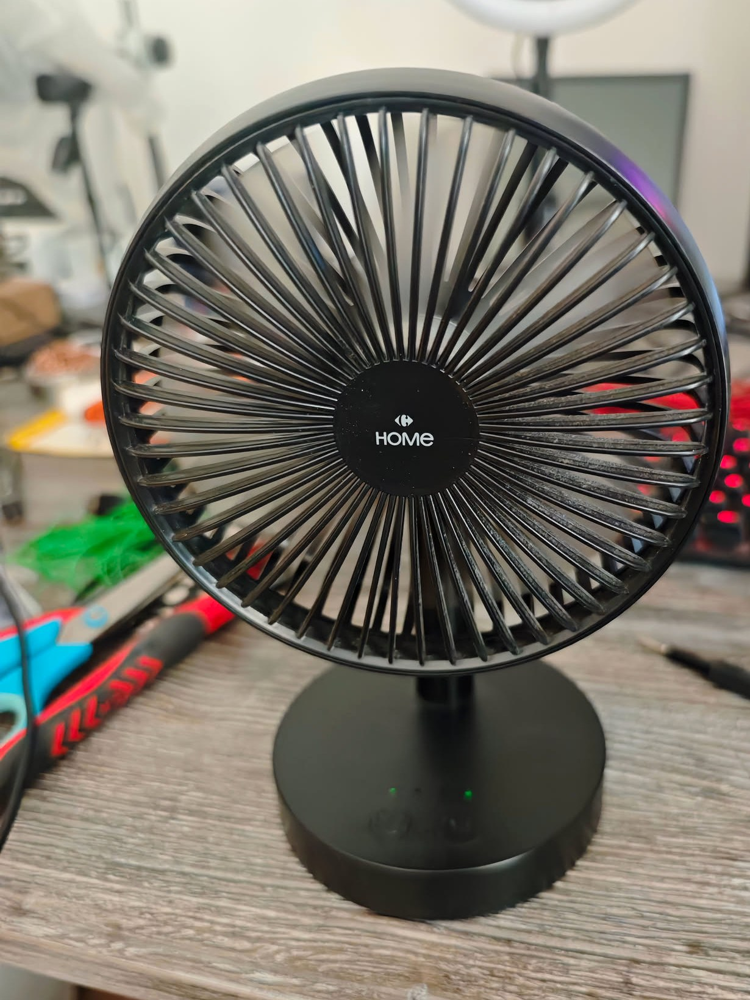
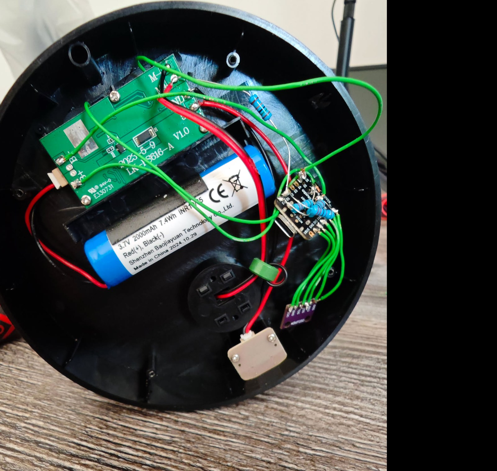
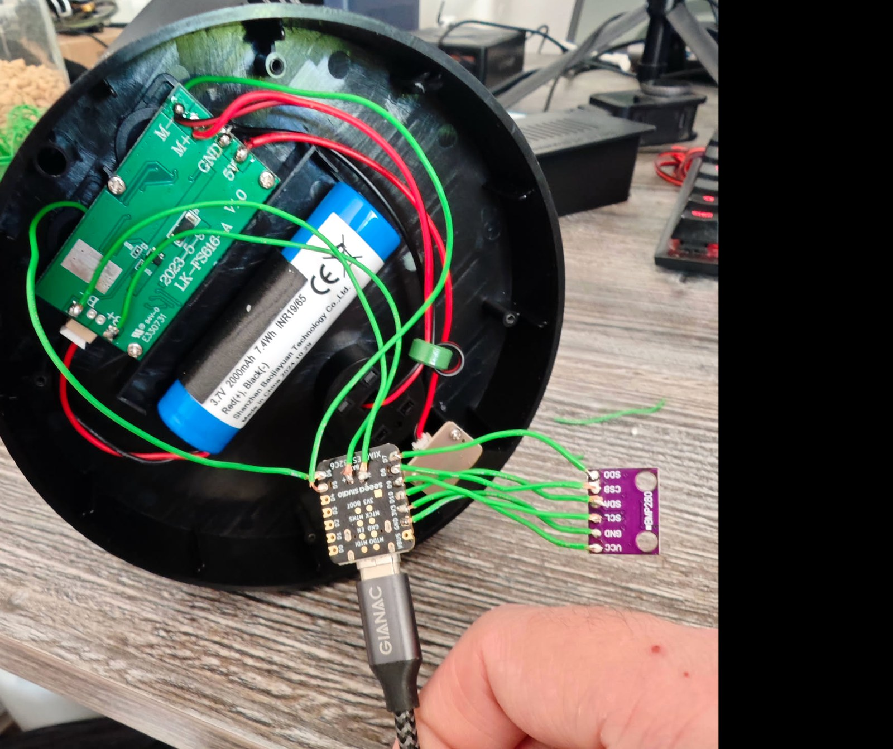
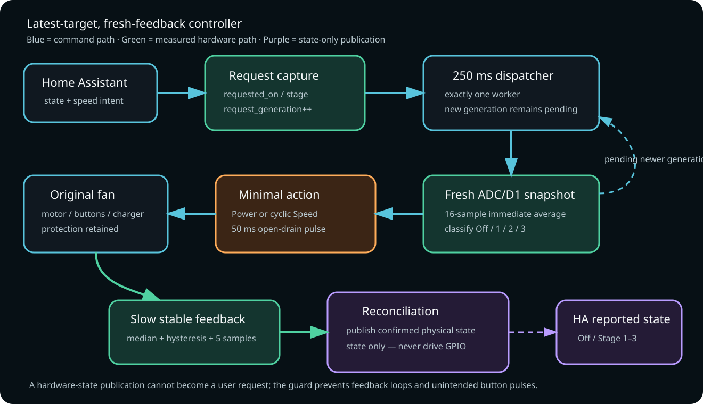
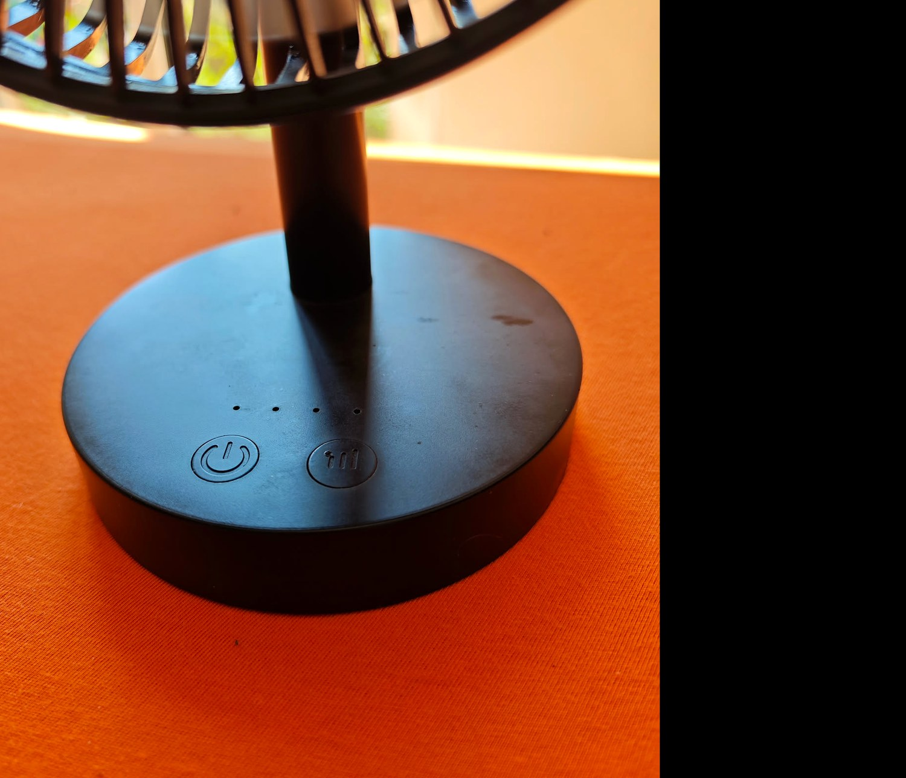

# XIAO ESP32C6 Smart Fan

[](https://esphome.io/)
[](https://wiki.seeedstudio.com/xiao_esp32c6_getting_started/)
[](LICENSE)

A hardware-verified retrofit that turns a simple three-speed rechargeable desk fan into a Wi-Fi/Home Assistant device **without replacing its original motor, charger, protection circuit, or buttons**.

The controller emulates the original active-low Power and Speed buttons, measures the real motor rail to identify Off/Stage 1/Stage 2/Stage 3, and converges from the freshly measured physical state to the latest requested state. Rapid commands are serialized by a generation-based worker instead of trusting delayed UI state.

> **German documentation:** [docs/README.de.md](docs/README.de.md)

> **Status:** Working prototype · hardware-specific · not certified. Recalibrate and electrically verify every different fan/controller revision before enabling button outputs.

<p align="center">
  
</p>

## What it can do

- Native encrypted ESPHome API and OTA updates over Wi-Fi.
- Home Assistant `fan` entity with three speeds.
- Original Power and Speed buttons remain functional.
- Active-low, 50 ms, open-drain button emulation; outputs are released afterward.
- Direct stage targeting without routinely power-cycling the fan:
  - Off → target: one Power pulse, then only the required Speed pulses.
  - Stage X → Stage Y: only the forward cyclic Speed pulses.
  - Running → Off: one Power pulse.
- Fresh motor-voltage sample before every controller pass; no dependency on delayed Home Assistant display state.
- Generation-based latest-target worker for sub-second command bursts.
- Stable motor-stage telemetry with median filtering, hysteresis, and five-sample confirmation.
- State-only feedback reconciliation: measured state can update Home Assistant but cannot generate a button pulse.
- Battery voltage and voltage-based state-of-charge estimate.
- Low-voltage protection: three readings below 3.05 V, deep sleep, 60 s wake checks, normal boot above 3.35 V.
- BMP280 temperature and pressure telemetry over SPI.

## Hardware

<p align="center">
  
  
</p>

The prototype uses:

- Seeed Studio XIAO ESP32C6 (ESP32-C6FH4)
- BMP280 breakout (SPI)
- 150 kΩ + 22 kΩ motor-feedback divider
- 220 kΩ + 220 kΩ battery divider
- verified common ground between fan electronics and XIAO
- original 1-cell battery, motor controller, charger and protection electronics

See [hardware/BOM.csv](hardware/BOM.csv) and [docs/wiring.md](docs/wiring.md).

## Pin map

| XIAO pin | ESP32-C6 GPIO | Function |
|---|---:|---|
| D0 / A0 | GPIO0 | Battery ADC through 220 kΩ / 220 kΩ divider |
| D1 / A1 | GPIO1 | Motor rail ADC through 150 kΩ / 22 kΩ divider |
| D5 | GPIO23 | Original Speed button input, active-low/open-drain |
| D6 | GPIO16 | Original Power button input, active-low/open-drain |
| D7 | GPIO17 | BMP280 MISO / SDO |
| D8 | GPIO19 | BMP280 CSB |
| D9 | GPIO20 | BMP280 SCK / SCL |
| D10 | GPIO18 | BMP280 MOSI / SDA |
| 3V3 | — | BMP280 supply |
| GND | — | Common ground |

## Measured motor-voltage clusters

These values belong to the documented prototype and **must be recalibrated for another fan/controller**.

| Physical state | Reconstructed motor rail |
|---|---:|
| Off, no charger in one test | ~3.565 V |
| Off, USB charging | 4.636–4.683 V |
| Stage 1 | 4.941–4.980 V |
| Stage 2 | 6.513–6.536 V |
| Stage 3 | 7.912–7.960 V |

The charging Off cluster and Stage 1 are only about 0.27 V apart. The firmware therefore uses a midpoint for initial classification, Schmitt thresholds for subsequent transitions, ADC multisampling, median filtering and five stable samples. See [docs/calibration.md](docs/calibration.md).

## Control architecture



Home Assistant supplies intent; the XIAO owns all GPIO actions:

1. `on_state` and `on_speed_set` store `requested_on`, `requested_stage` and increment `request_generation`.
2. A 250 ms dispatcher starts one single-owner worker if a generation is pending.
3. The worker force-updates the motor ADC and classifies the immediate 16-sample average.
4. It executes the minimum bounded pulse sequence from measured stage to requested stage.
5. It marks only the generation captured at worker start as handled. A newer request remains pending and gets another fresh physical read.
6. Slow filtered feedback later becomes authoritative for Home Assistant reconciliation, without touching the button outputs.

This design avoids the common `mode: restart` failure where a new request cancels a sequence after a physical pulse, and avoids relying on stale filtered/UI state.

## Quick start

### 1. Inspect and measure first

Do not assume another fan uses safe 3.3 V button signals or a ground-referenced motor rail.

- Disconnect power and identify Power, Speed, BAT+, BAT−, Motor+ and Motor−.
- Verify button-pad idle/pressed voltages and common ground with a multimeter.
- Confirm the selected motor low side remains at common ground in all states.
- Size dividers for the maximum credible voltage plus transient margin.
- First deploy voltage telemetry only and measure every state, both with and without charging.

### 2. Configure ESPHome secrets

```bash
cp esphome/secrets.example.yaml esphome/secrets.yaml
# edit esphome/secrets.yaml with your own values
```

### 3. Validate and commission over USB

```bash
python -m venv .venv
. .venv/bin/activate
pip install "esphome==2026.6.5"
esphome config esphome/ventilator-controller.yaml
esphome run esphome/ventilator-controller.yaml
```

The recommended workflow is **USB once, Wi-Fi/API/OTA immediately**. After the first successful boot and encrypted API verification, build and upload directly over the network:

```bash
esphome run esphome/ventilator-controller.yaml --device xiao-esp32c6-smart-fan.local
```

### 4. Add it to Home Assistant

ESPHome discovery normally offers the device automatically. Enter the API encryption key from your local `secrets.yaml`. Use the native three-speed fan entity; no custom stage buttons are required. See [docs/home-assistant.md](docs/home-assistant.md).

## Verified prototype behavior

Real hardware tests included:

- individual `3 → 1`, `1 → 2`, `2 → 3`, and final Off transitions;
- rapid `Stage 1 → Stage 3 → Off` requests within 0.99 s, ending physically Off;
- rapid `Off → Stage 1 → Stage 2 → Stage 3` requests within 1.08 s, ending physically at Stage 3 (~7.92 V);
- feedback reconciliation from the original hardware button;
- USB charging while distinguishing Off from Stage 1;
- encrypted Native API and OTA reconnect;
- safe final state after tests.

The exact evidence boundary—including which firmware was exercised on hardware and which checks remain open—is documented in [docs/testing.md](docs/testing.md).

## Photos

<p align="center">
  
  
</p>

The repository images were exported from the owner's private photo library, cropped for technical relevance, re-encoded, and stripped of EXIF/GPS metadata before publication.

## Safety and limitations

- Modifying a Li-ion-powered appliance can cause fire, electric shock, battery damage or controller failure.
- Treat flashing, rebooting, restored state and Home Assistant commands as possible motor-start events during commissioning. Keep hands and loose objects clear and disconnect the motor while validating an unknown interface where practical.
- The XIAO is **not** the battery charger or BMS. The original electronics remain responsible for charging and protection.
- The photographed prototype was powered/programmed through USB during development. Do not connect the cell directly to XIAO 3V3/5V.
- Never connect Motor+ directly to an ADC pin.
- Direct GPIO button emulation is appropriate only after proving compatible voltage levels and common ground. Otherwise use a transistor, MOSFET or optocoupler interface.
- Motor outputs may be PWM even when a multimeter shows a stable average.
- Voltage-derived battery percentage is an estimate affected by load, chemistry, temperature and calibration.
- The narrow charging-Off/Stage-1 gap may not remain valid with another charger, cable, battery or fan revision.
- The low-voltage thresholds supplement; they do not replace the cell protection circuit.
- Keep the ESPHome API and OTA service on a trusted local network or VPN; do not expose ports 6053/3232 directly to the Internet.

## Repository layout

```text
esphome/                 ESPHome firmware and secrets template
hardware/                BOM / parts list
docs/diagrams/           public wiring and architecture drawings
docs/                    wiring, calibration, HA setup and German documentation
docs/images/             privacy-sanitized project photos
tools/                   optional serial bring-up helper
.github/workflows/       ESPHome validation/compile CI
```

## License

Software, diagrams and documentation are released under the [MIT License](LICENSE). Product names and trademarks belong to their respective owners.
