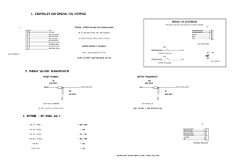
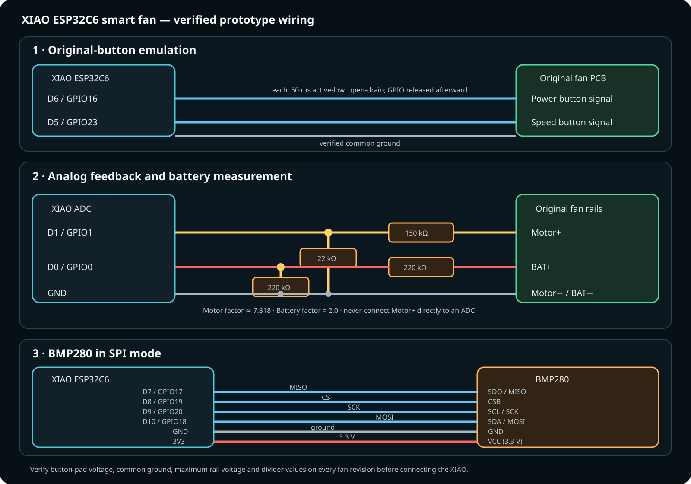

# Wiring

## Electrical schematic

The SVG is reproducibly generated from [`generate_circuit_schematic.py`](diagrams/generate_circuit_schematic.py) with the pinned dependency in [`requirements-diagrams.txt`](../requirements-diagrams.txt).

This schematic separates the original fan electronics from the retrofit. The XIAO emulates the existing buttons and measures the motor and battery rails through voltage dividers; it does **not** drive the motor directly. The documented prototype powers/programs the XIAO through USB and has no fan-battery power feed into XIAO 3V3 or 5V.

## Simplified wiring overview

## Button emulation

The original fan controller exposes separate Power and Speed push-button signals. In the measured prototype, pressing either button shorts its signal to common ground. D6/GPIO16 and D5/GPIO23 emulate this with inverted open-drain outputs for 50 ms.

Before reproducing this:

1. Measure idle and pressed voltage at both button pads.
2. Prove that fan ground and XIAO ground may be connected.
3. Confirm that no button signal can exceed ESP32-C6 GPIO limits.
4. Use a transistor/MOSFET/opto-isolated interface if compatibility is uncertain.

## Motor feedback divider

`Motor+ → 150 kΩ → D1/GPIO1 → 22 kΩ → GND`

- Divider ratio: `22 / 172 ≈ 0.1279`
- Reconstruction factor: `172 / 22 ≈ 7.818`
- Thevenin resistance: `150 kΩ || 22 kΩ ≈ 19.2 kΩ`

A 100 nF capacitor from D1 to ground can improve PWM/noise averaging, but it was not fitted in the documented prototype. Software uses 16-sample ADC averaging and a five-value median.

## Battery divider

`BAT+ → 220 kΩ → D0/GPIO0 → 220 kΩ → GND`

This divides a one-cell battery voltage by two. The original fan electronics still charge and protect the cell.

## BMP280 SPI

| BMP280 | XIAO |
|---|---|
| VCC | 3V3 |
| GND | GND |
| SDO | D7 / GPIO17 (MISO) |
| CSB | D8 / GPIO19 |
| SCL | D9 / GPIO20 (SCK) |
| SDA | D10 / GPIO18 (MOSI) |

Breakout labels vary. Verify the module schematic and 3.3 V compatibility.

## Power topology

The development prototype shows the XIAO powered/programmed via USB. The fan battery is not connected directly to XIAO 3V3 or 5V. If a self-contained power supply is desired, design and verify a separate regulated supply and ensure that charging through two paths cannot occur.
